# Faiss Introduction
- FAISS 는 페이스북에서 공개 한 벡터 전용 서치 라이브러리 혹은 엔진 이다.
- 최근 딥러닝이 많은 산업에 녹아들면서 벡터를 효율적으로 검색 해야 하는 Needs 가 폭증하고 그에 따라 각광받게 된 라이브러리 중 하나이다.
- 사실 벡터를 찾는 라이브러리는 이미 시중에 많은 오픈소스가 공개 되어 있지만 페이스북의 명성과 함께 훌륭한 퍼포먼스로 인해 Game Changer 소리를 들을 정도로 소문이 자자한 라이브러리 이니 한번쯤 제대로 살펴 볼 시간이 필요하다고 생각 하여 이 글을 쓴다.
- 매우 직관적인 사용자 프렌들리 인터페이스를 가지고 있어 사실 예제 몇줄만 보면 칠판도 이해 할 수 있을 정도로 간편한 사용법을 자랑한다.
- 다만 프로젝트 별로 다루는 데이터나 구현 내용에 따라 전략적으로 인덱스를 변경해야 할 필요가 있다.
- 따라서 이번 글에선 인덱스를 고를 때 생각 할 수 있는 힘을 가질 수 있도록 인덱스들의 원리나 벤치마크등을 조금 집중적으로 다룰 생각이다.

## 이 글에 앞서..
- 찬찬히 뜯어 볼거긴 하지만 faiss 의 인덱스 종류에는 대표적으로 Flat, IVF, LSH, PQ 등이 있다.
- 카오스의 히든캐릭 처럼 당첨만 되면 무조건 장땡인 그런 인덱스는 없고 각각의 장단점이 있다.
- 아마도 faiss 를 처음 접하는 경우 어떤 인덱스를 사용해야 하는지 의문이 들 수 있을거라고 본다.
- Faiss 의 인덱스는 모두 trade off 관계에 있다. 정확도를 위해 속도나 메모리를 포기하거나 정확도를 조금 손해보고 속도를 높이거나 메모리를 높이거나 하는 방식이다.
- 한꺼번에 설명하기 빡세니 한개씩 뜯어보자.

## Index Cheat sheet
- 아래는 도쿄대에서 강의 자료로 사용 된 Index cheat sheet 이다.
- 긴 글을 읽기 귀찮다면 그냥 아래 그림을 참조하고 대충 갖다 쓰자.
  

# 1. Flat
### 인덱스 설명
- 가장 간단한 인덱스로 bruteforce 를 이용하여 해당 점과 인덱스 내의 모든 벡터들과 연산하여 적정 값을 찾아 낸다.
  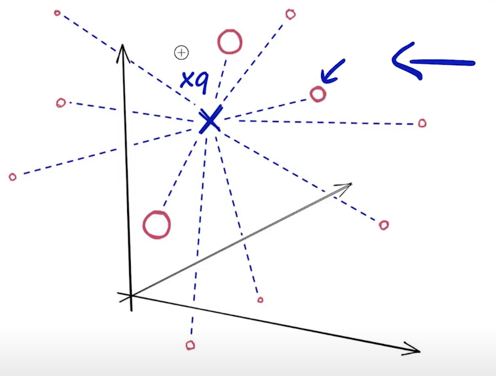
- 해당 그림의 빨간색 동그라미들이 이미 저장 된 벡터를 뜻하며 xq 는 검색하고자 하는 벡터의 위치이다.
- 해당 xq 와 `모든` 점들의 값을 계산 하고 가장 근접한 순으로 요청 한 만큼 결과를 내어 준다.
- bruteforce 인 만큼 검색 퀄리티는 `100%` 이지만 성능은 다른 인덱스들에 비해 비약적으로 떨어진다.
- 아래에서 설명 하겠지만 Product Quantization 같은 경우 저장되는 벡터들이 압축 되므로 메모리 공간을 매우 효율적으로 사용 할 수 있지만 해당 인덱스에선 그런 것들을 기대 할 수 없다.
- GPU 를 사용 할 수 있으므로 GPU 가 포함 된 노드에선 성능 향상을 꾀 할 수 있다.

### IndexFlatL2 구현
- faiss 를 이용하여 IndexFlatL2 를 구현 해보자.
  ```python
  index = faiss.IndexFlatL2(d)   # build the index
  print(index.is_trained)        # True will be printed
  index.add(xb)                  # add vectors to the index
  
  k = 4                          # we want to see 4 nearest neighbors
  D, I = index.search(xb[:5], k) # sanity check
  ```
- 이것이 전부다.
- 2번째 줄의 index.is_trained를 좀 살펴보자.
- 주석을 보면 알겠지만 `assert is_trained == True` 이다.
- 처음 보는 사람은 이 부분이 의아 할텐데 사실 해당 인덱스에서 트레이닝은 필요하지 않다.
- 따라서 트레이닝에 관련 된 아무 처리조차 하지 않았음에도 불구하고 True 를 반납 하는 것이다.
- 트레이닝에 관련 된 예제는 아래 IndexIVFFlat 나 IndexIVFPQ 에서 볼 수 있다.

### Flat Balance
- 보다시피 성능보다 search quality 에 몰빵한 인덱스 이다.
  
- 128차원 정도 되는 벡터 10000~20000개 수준에서 맥북프로 기본 cpu (m1 chip 아님) 기준 0.2초 이하의 수준을 보여준다.


# 2. IVF (Inverted File Index)
### 인덱스 설명

- 눈치 빠른 사람은 아래 그림만 봐도 어느정도 눈치를 깔 것이다.
  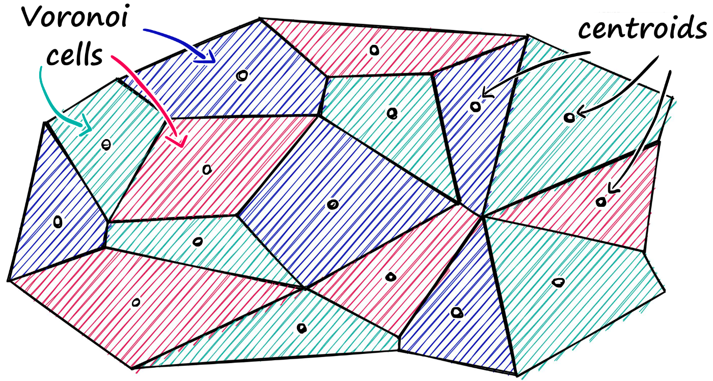
- 해당 인덱스는 상단 그림처럼 데이터를 가지고 Cluster 를 형성 한다.
- 위의 셀들을 voronoi cell 이라 부르고 그 셀 중앙 값을 centroids 라고 부른다.
- 쿼리를 요청 시 xq 과 centroids 들과의 거리만 계산한다.
  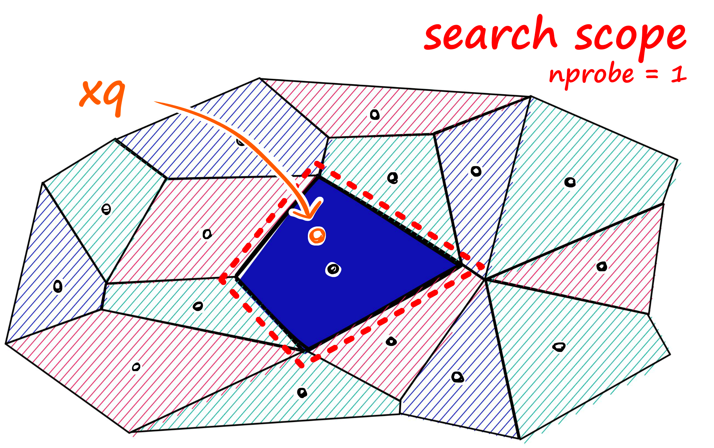
  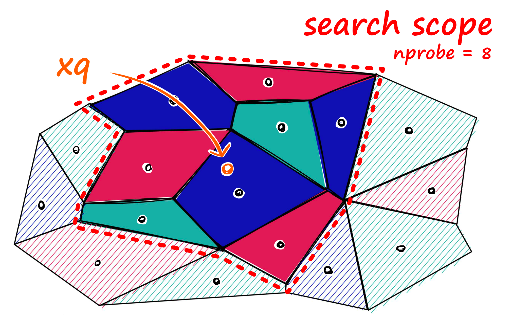
- centroids 간의 거리를 바탕으로 가장 인접한 셀들을 nprobe 값 만큼 가져온다.
- nprobe 값이 너무 작으면 아쉽게 놓치는 인접 셀들이 많아질테고 그렇다고 너무 크면 Flat 과 다를바가 없어진다.
- 적정한 값을 채택 시 꾀 높은 수준의 퀄리티와 빠른속도를 가질 수 있다.

### IndexIVFFlat 구현
  ```python
  nlist = 50  # how many cells
  quantizer = faiss.IndexFlatL2(d)
  index = faiss.IndexIVFFlat(quantizer, d, nlist)
  
  print(index.is_trained)  # False
  
  index.train(sentence_embeddings)
  print(index.is_trained)  # True
  
  index.add(sentence_embeddings)
  
  D, I = index.search(xq, k)  # search
  print(I)
  # [[ 9900  9309  9810 10048]
  # [11055 10895 10812 11321]
  # [11353 10164  9787 10719]
  # [10571 10664 10632 10203]
  # [ 9628  9554  9582 10304]]
  # CPU times: user 3.83 ms, sys: 3.25 ms, total: 7.08 ms
  # Wall time: 2.15 ms
  
  index.nprobe = 10  # which defines how many nearby cells to search.
  
  D, I = index.search(xq, k)  # search
  print(I)
  # [[ 9900 10500  9309  9831]
  # [11055 10895 10812 11321]
  # [11353 11103 10164  9787]
  # [10571 10664 10632  9638]
  # [ 9628  9554 10036  9582]]
  # CPU times: user 5.29 ms, sys: 2.7 ms, total: 7.99 ms
  # Wall time: 1.54 ms
  ```
- nlist 를 봐보자, 저 값은 클러스터 군집 시 셀을 몇개나 만들지를 설정하는 값이다.
- 해당 값은 50개이므로 실제로 군집들은 50개의 voronoi cells 와 centroids 를 가지게 될 것이다.
- nprobe 값은 디폴트로 1이다
- nprobe 를 10으로 올리니 조금 다른 결과가 나옴을 유의하라.
- 해당 값을 올리면 예상되는 검색 속도는 느려지고 검색 결과는 대부분의 경우 더 높은 품질을 보증한다.

### IndexIVFFlat Benchmark
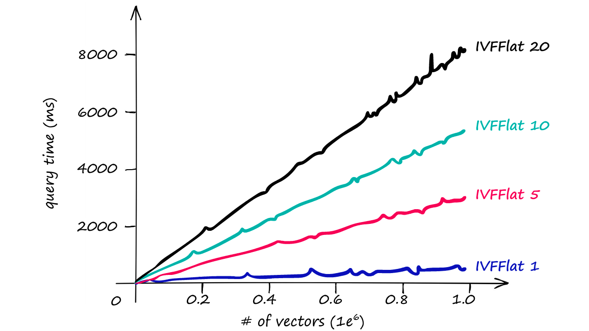
- 상단 값은 검색이 돌아가는 서버의 spec 에 따라 다르므로 자신의 데이터셋 크기와 하드웨어 성능등을 고려하여 적정한 값을 직접 구해야 한다.
- Table: Flat vs IVF

  |Index|Memory|Query Time|Recall|Notes|
    |------|---|---|---|---|
  |Flat|~500Mb|~18ms|100%|Good for small datasets or where query time is irrelevant|
  |IVF|~520Mb|~9ms|70~95%|Good scalable option. High-quality, at reasonable speed and memory usage|

### IVF Index Reconstruction
- 해당 인덱스를 사용하는 벡터검색 서버를 운영한다 가정 해보자.
- 아마 해당 서버에선 수많은 insert 와 delete가 이루어 질 것이고
- 초반에 다져놨던 클러스터는 아마 시간이 어느정도 흐른 후 비효율적인 클러스터가 될 가능성이 있다.
- 따라서 어느정도 변경이 있는 후에는 적절히 클러스터를 재건해 주어야 할 것이다.
- 이 때 무턱대고 `index.reconstruct(<vector_idx>)` 호출하면 RuntimeError 를 만나게 될 것이다.
- 그럴 땐 당황하지 말고 아래와 같이 적용해 보자.

    ```python
    index.make_direct_map()
    index.reconstruct(7460)[:100]
    
    # the below will be printed.
    
    array([ 0.01627046,  0.22325929, -0.15037425, -0.30747262, -0.27122435,
           -0.10593167, -0.0646093 ,  0.04738174, -0.7334904 , -0.37657705,
           -0.76762843,  0.16902871,  0.53107643,  0.5117669 ,  1.1441585 ,
           -0.08562929, -0.6724008 , -0.96637076,  0.02545463, -0.21559823,
           -1.256566  , -0.8298215 , -0.09825023, -0.21850856,  0.5061023 ,
            0.10527933,  0.5039688 ,  0.65242976, -1.3945869 ,  0.6584745 ,
           -0.21525341, -0.22487433,  0.8181835 ,  0.084643  , -0.761417  ,
           -0.28928292, -0.09825806, -0.730462  ,  0.07855812, -0.84354657,
           -0.5924206 ,  0.77471375, -1.2092053 , -0.22757971, -1.307336  ,
           -0.23081468, -1.3132254 ,  0.01629073, -0.97285444,  0.19308169,
            0.47424558,  1.1892087 , -1.9674131 , -0.70061135, -0.29638717,
            0.605337  ,  0.6240745 , -0.70340395, -0.86754197,  0.17673187,
           -0.1917053 , -0.02951987,  0.22623563, -0.16695444, -0.8040254 ,
           -0.45918915,  0.69675523, -0.24928184, -1.014787  , -0.921745  ,
           -0.33842632, -0.39296737, -0.8373483 , -0.11479235,  0.4604967 ,
           -1.4521122 ,  0.60310453,  0.38696304, -0.04061254,  0.00453161,
            0.24117804,  0.05396278,  0.07506453,  1.0511587 ,  0.12383959,
           -0.71281093,  0.11722917,  0.52238214, -0.04581215,  0.2682711 ,
            0.8598538 , -0.3566995 , -0.6466709 , -0.5435797 , -0.0431047 ,
            0.9513919 , -0.15605772, -0.49625337, -0.11140176,  0.15610115],
          dtype=float32)
    ```
- 그러면 우리는이전과 마찬가지로 벡터를 재구성할 수 있다.
### When to use
- facebook 공식 홈페이지에선 해당 인덱스를 다음과 같은 경우에 사용하길 권고 하고있다.
    1. 메모리 용량이 충분히 클 때
    2. 인덱스에 저장 될 벡터가 1M 이하 일 때.
    3. Node 가 GPU 를 사용 할 수 있고 쿼리속도 결과가 납득 가능 할 때.
    4. index composition 의 경우 조금 더 복잡하니 아래 링크를 참조하자
    5. https://github.com/facebookresearch/faiss/wiki/Guidelines-to-choose-an-index


# 3. PQ
### 인덱스 설명
- Product Quantization 의 줄임말이다.
- 눈치 챘는지 모르겠지만 Flat 이나 IVF 인덱스는 전체 벡터를 저장 했다.
- 이런 방식은 매우 큰 데이터 세트에서는 메모리 용량이 문제가 될 수 있다.
- 다행스럽게도 Faiss 는 Product Quantization(양자화)를 사용하여 벡터를 압축할 수 있는 기능을 제공한다.
- 양자화 정책을 이용하면 쿼리속도를 높일 수 있을 뿐 아니라 저장 되는 벡터의 사이즈 마저 축소 된다.
- 당연하겠지만 어느정도의 정확도 손실은 가져가야 한다.
- 하지만 아주 큰 데이터세트에선 분명히 유효하고 적절한 방법이다.
    - 인스타그램에선 이방식을 통해 아주 젊고 영한 쭉쭉빵빵 아가씨 사진을 내게 미친듯이 feed 하고 있다.
        - 여자친구 앞에서 진짜 틀기가 무섭다..
    - 사실 엄청나게 많은 데이터 속에서 궂이 특정 데이터가 아니더라도 젊고 영한 아가씨 사진만 나와야 되는 경우라면 해당 인덱스는 좋은 솔루션이 될 것이다.

### 그래서 양자화가 뭔데?
- 갑자기 양자양자 하니깐 양자역학에 나오는 전자의 퀀텀점프 생각 나기도 하는데 그런건 잠시 잊도록 하자.
    - 플랑크 상수나 머 그런건 여기 안나오니깐 걱정 않해도 된다.
- 일단 추상적으로 예기 해보자면 "양자화는 데이터를 더 작은 공간으로 압축하는 일반적인 방법입니다" 라고 한다.
    - 개인적으로 위와 같이 설명 해주면 짜증난다.
- 이해를 돕기 위해 먼저 아래 차원축소 그림을 봐보자.
  
    - D 는 벡터의 차원이다. S 는 전체 스코프 이다.
    - 대충 말해 보자면 128차원 벡터를 일련의 과정을 통해 64차원 벡터로 저장 하는것이다.
        - 어떻게? 그건 데이터싸이언스 형님들이 해두셨다고 하니 일단 믿고 계속 가보자..
- 이제 드디어 양자화를 봐보자.
  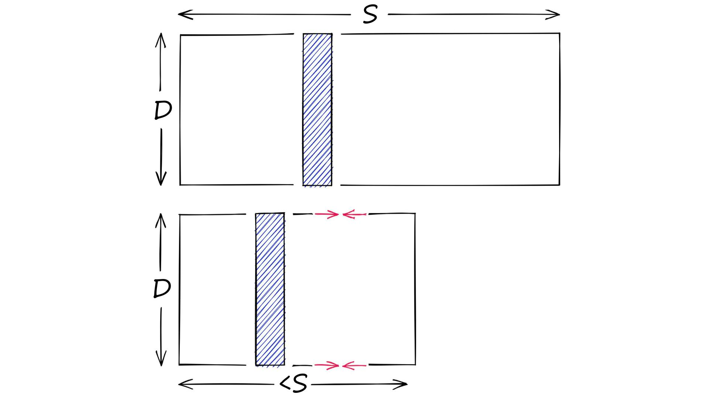
    - 별거 없다.. 양자화는 벡터의 크기가 아니라 검색해야 하는 Scope 자체를 줄여버렸다.
    - 뭐 그렇다고 한다.. 위에서 봤던 IVF도 일종의 양자화가 아닌가 라는 생각이 든다.
    - 그렇다 쳐도 사실 IVF 는 `전체 인덱스를 저장`한다는 면에서 조금 차이가 난다.
    - 나도 조금 헥갈리는 부분인데 양자화는 저렇게 설명 해노코 사실 PQ는 `차원축소 and 양자화` 두개 다 해버렸다.


### Simple IndexPQ Process
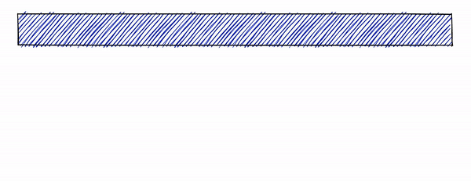
  1. Taking a big, high-dimensional vector,
  2. Splitting it into equally sized chunks — our subvectors,
  3. Assigning each of these subvectors to its nearest centroid (also called reproduction/reconstruction values),
  4. Replacing these centroid values with unique IDs — each ID represents a centroid
  


### 코드로 구현 한 Simple Product Quantization
- `백문이 불여일타` 라고 하니 그림과 함께 파이썬 코드를 참조하자.
  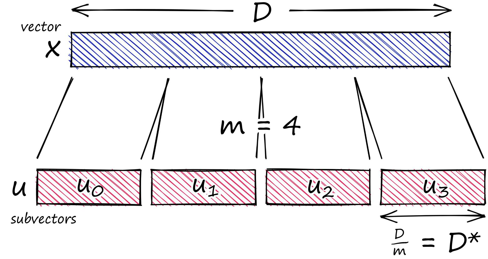
  ```python
  x = [1, 8, 3, 9, 1, 2, 9, 4, 5, 4, 6, 2]
  
  m = 4
  D = len(x)
  # ensure D is divisable by m
  assert D % m == 0
  # length of each subvector will be D / m (D* in notation)
  D_ = int(D / m)
  
  # now create the subvectors
  u = [x[row:row+D_] for row in range(0, D, D_)]
  print(u)
  # [[1, 8, 3], [9, 1, 2], [9, 4, 5], [4, 6, 2]]
  ```
- 보다시피 고차원의 벡터를 저차원의 벡터 집합으로 변경 하였다.
- 아직 전체 데이터는 그대로 이므로 뭔가 차원손실이나 데이터 손실이 없는 상태이다.

- 이제 할 일은 저 Subvectors 들을 이미 trained 된 클러스터에 매핑 시키는 것이다.
- trained 된 클러스터 또한 3 * 4 인 벡터들의 집합을 가지고 IVF 처럼 클러스터를 만들어 둔 것이다.
- 가상의 클러스터링을 만들기 위해서 아래처럼 랜덤 함수를 이용하여 생성해보자.
  ```python
  from random import randint
  
  k = 2**5
  assert k % m == 0
  k_ = int(k/m)
  print(f"{k}, {k_}")
  # k=32, k_=8
  
  c = []  # our overall list of reproduction values
  for j in range(m):
    # each j represents a subvector (and therefore subquantizer) position
    c_j = []
    for i in range(k_):
      # each i represents a cluster/reproduction value position *inside* each subspace j
      c_ji = [randint(0, 9) for _ in range(D_)]
      c_j.append(c_ji)  # add cluster centroid to subspace list
    # add subspace list of centroids to overall list
    c.append(c_j)
  
  # cluster has been created..
  print(c)
  # [
  #     [[7, 2, 3], [4, 6, 7], [7, 0, 3], [9, 4, 6], [8, 1, 3], [5, 3, 6], [7, 3, 0], [8, 2, 8]],
  #     [[7, 0, 3], [6, 0, 5], [3, 6, 5], [1, 6, 6], [8, 6, 3], [6, 3, 6], [4, 4, 8], [5, 1, 4]],
  #     [[2, 8, 8], [8, 5, 0], [2, 0, 4], [9, 5, 2], [9, 6, 7], [5, 8, 6], [2, 7, 2], [6, 2, 8]],
  #     [[2, 4, 7], [4, 6, 9], [0, 5, 1], [2, 4, 2], [2, 5, 8], [3, 8, 5], [1, 4, 1], [1, 3, 8]],
  # ]
  
  ```

- 이제 남은 일은 아래 그림처럼 우리의 서브벡터를 이미 준비 된 클러스터에 매핑 하는 것이다.
  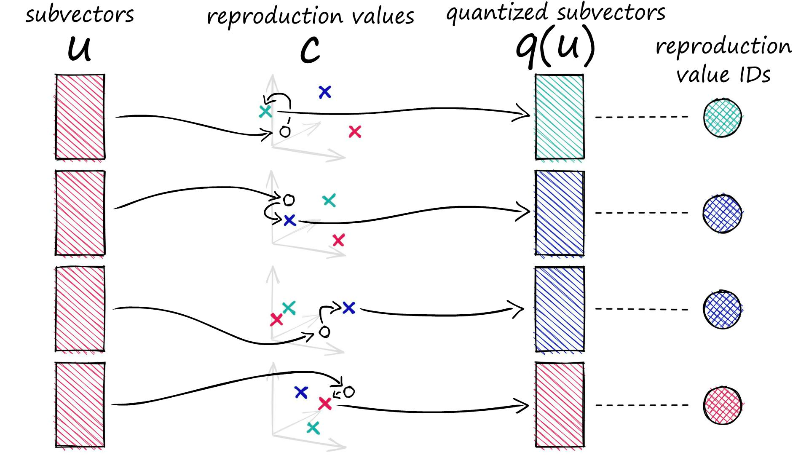
  ```python
  def euclidean(v, u):
      distance = sum((x - y) ** 2 for x, y in zip(v, u)) ** .5
      return distance
  
  def nearest(c_j, u_j):
      distance = 9e9
      for i in range(k_):
          new_dist = euclidean(c_j[i], u_j)
          if new_dist < distance:
              nearest_idx = i
              distance = new_dist
      return nearest_idx
  
  ids = []
  for j in range(m):
    i = nearest(c[j], u[j])
    ids.append(i)
  print(ids)
  # [1, 1, 2, 1]
  ```

- 드디어 양자화 된 클러스터들의 ids 에 해당하는 벡터를 얻었다.
- 해당 값은 나중에 전체 중심에 다시 매핑하는 데 사용할 수 있다.
  ```python
  q = []
  for j in range(m):
      c_ji = c[j][ids[j]]
      q.extend(c_ji)
  
  print(q)
  # [1, 7, 7, 6, 3, 6, 7, 4, 4, 3, 9, 6]
  ```

### IndexPQ 구현
- faiss 를 이용해 Product Quantization 을 이용해 인덱스를 관리 해보자.
  ```python
  import faiss
  
  D = xb.shape[1]
  m = 8
  assert D % m == 0
  nbits = 8  # number of bits per subquantizer, k* = 2**nbits
  index = faiss.IndexPQ(D, m, nbits)
  
  print(index.is_trained)
  # False
  
  index.train(xb)  # PQ training can take some time when using large nbits
  
  dist, I = index.search(xq, k)
  index.search(xq, k)
  # 1.49 ms ± 49.1 µs per loop (mean ± std. dev. of 7 runs, 1000 loops each)
  ```

- recall performance 측정을 위해 indexFlat 과 비교해 보자.
  ```python
  l2_index = faiss.IndexFlatL2(D)
  l2_index.add(xb)
  
  l2_dist, l2_I = l2_index.search(xq, k)
  # CPU times: user 46.1 ms, sys: 15.1 ms, total: 61.2 ms
  # Wall time: 15 ms
  
  recall = sum([1 for i in I[0] if i in l2_I])
  print(recall)
  # 50
  ```
- 보다시피 회수율은 약 50% 이다.
- 처음엔 나는 회수율을 보고 좀 당황하긴 했는데 앞서 말했듯 엄청나게 많은 데이터 속에서 어찌됬건 이쁜여자 사진이나 나오면 된다 라는 정도의 구현이라면 해당 인덱스도 충분히 각광 받을 수 있겠다는 생각이 든다.

### PQ Benchmark
- Flat vs PQ

  |Index|Memory|Query Time|Recall|Notes|
  |------|---|---|---|---|
  |Flat|~256Mb|~8.2ms|100%|Good for small datasets or where query time is irrelevant|
  |PQ|~6.5Mb|~1.49ms|50%|compression and search speeds, with reasonable recall score|
- memory 사용량을 보라 압도적인 compression 이 가능하다.
- query 시간도 엄청나게 줄어든 것을 볼 수 있다.


### IndexIVFPQ
- 이름을 잘 봐보길 바란다.
- IVF + PQ 이다.
- IVF 와 PQ 는 지금 껏 설명해온 그 인덱스들이 맞고 지금 이거는 두개를 같이 쓰겠다는 거다.
- 위의 벤치마크에선 Flat과 PQ를 비교 했지만 사실 PQ만 사용하는 경우는 드문 것 같다.
- 페이스북에서도 대뜸 IndexIVFPQ 를 튜토리얼로 제공 한다.
- 이렇게 사용하는 이유는 압도적으로 쿼리 속도가 빨라지고 회수율도 증가 하지만 아주 적은 수준의 메모리만 더 잡아먹기 때문이다.
    - 자세한건 아래 벤치마크에서 확인하길 바란다. ( 납득이 될 것이다.. )
- 어쨌든 이름만 봐도 대충 어떻게 동작 하는지 이해가 갈 것 같지만 조금더 부연설명을 해보고자 한다.

### Simple IndexIVFPQ Process
- 아래는 여태 설명한 PQ 의 과정이다.
  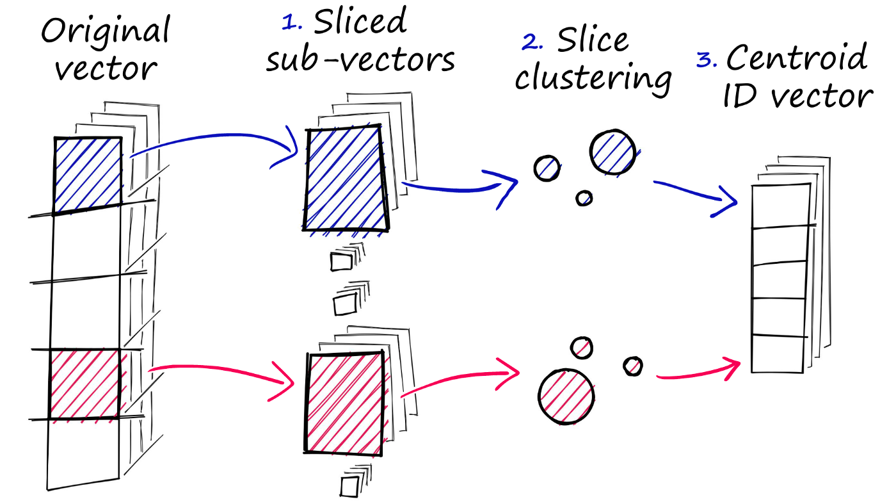
- PQ 과정을 거치면 Cluster 내부 중심벡터들의 아이디로 치환 된다는 것을 이제 우리는 잘 알고 있다.
- 그런 변환 된 벡터들을 한곳에 모아보면 아마 아래와 같은 그림이 될 것이다. (아래는 PQ 된 벡터들이다)
  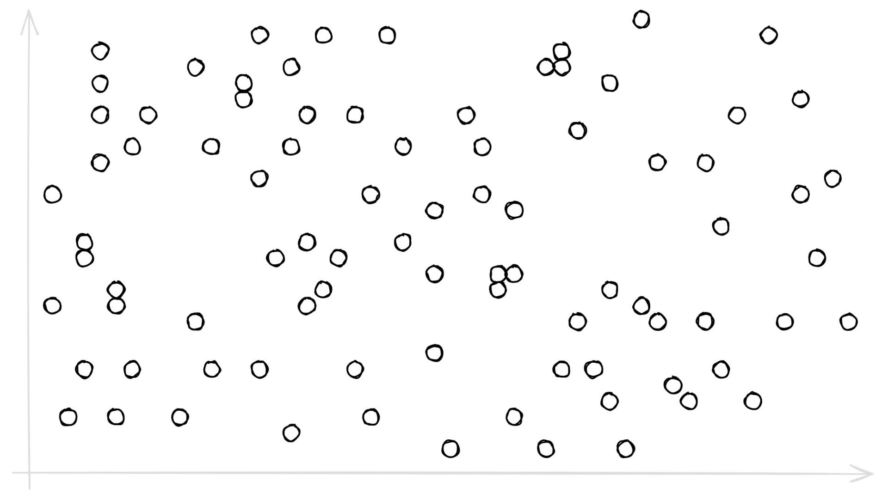
- 그다음 Voronoi cell 을 입혀보자.
  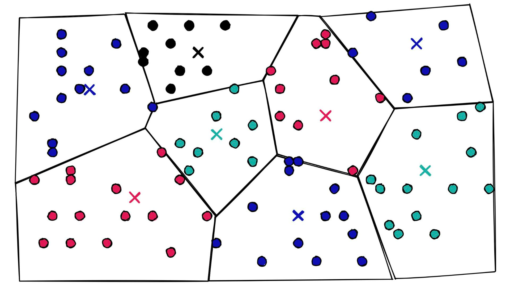
- 이제 우린 nprobe 값과 함께 초고속 select 가 가능하다.
  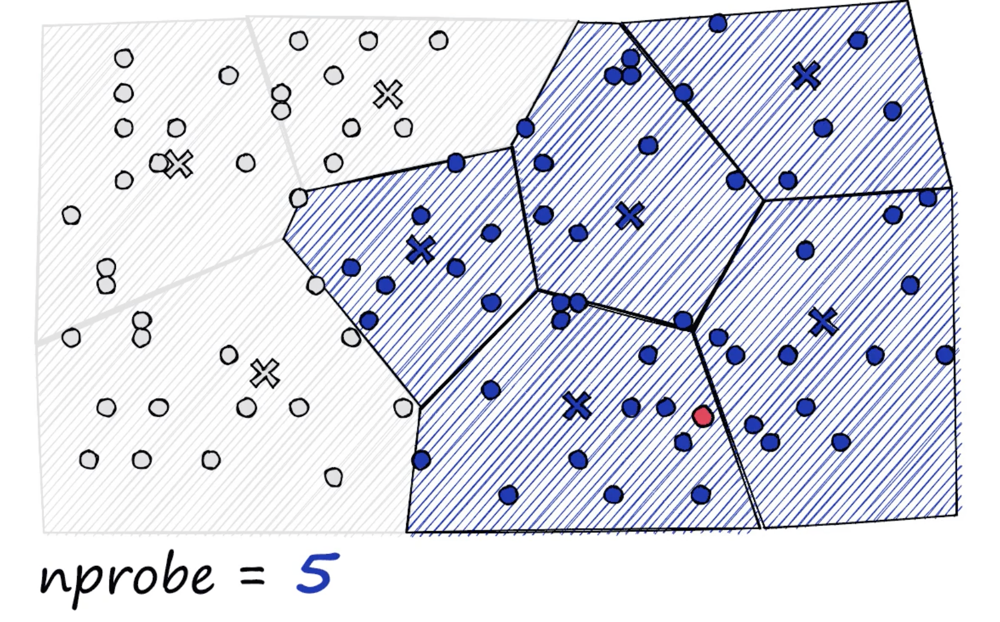

### Optimizing nprobe value
- nprobe 의 디폴트는 1 인데, 사실 이렇게 사용하면 PQ recall 50% 에서 38%로 미친듯이 줄어드는 광경을 볼 수 있다.
- 따라서 nprobe 값을 올려 옵티마이징을 해야 하는데 다음 예제를 통해서 적정값을 도출하는 과정을 지켜보자.
  ```python
  index.nprobe = 2048  # this is searching all Voronoi cells
  dist, I = index.search(xq, k)
  sum([1 for i in I[0] if i in l2_I])
  # 52%
  
  index.nprobe = 2
  dist, I = index.search(xq, k)
  sum([1 for i in I[0] if i in l2_I])
  # 39%
  
  
  index.nprobe = 48
  dist, I = index.search(xq, k)
  sum([1 for i in I[0] if i in l2_I])
  # 52
  ```
- 보다시피 2048이 maximum 임에도 불구하고 `index.nprobe = 48` 일 때와 결과가 같다.
- 속도를 고려 했을 때 `nprobe = 48` 이상을 할당 할 이유가 없다.


### IndexIVFPQ 구현
- 아래 코드를 참조하자
  ```python
  nlist = 100
  m = 8
  k = 4
  quantizer = faiss.IndexFlatL2(d)  # this remains the same
  index = faiss.IndexIVFPQ(quantizer, d, nlist, m, 8)
                                    # 8 specifies that each sub-vector is encoded as 8 bits
  index.train(xb)
  index.add(xb)
  D, I = index.search(xb[:5], k) # sanity check
  print(I)
  print(D)
  index.nprobe = 10              # make comparable with experiment above
  D, I = index.search(xq, k)     # search
  print(I[-5:])
  ```

### IndexIVFPQ Benchmark
- 아래는 FlatL2 vs IVFFlat vs IVFPQ 벤치마크
  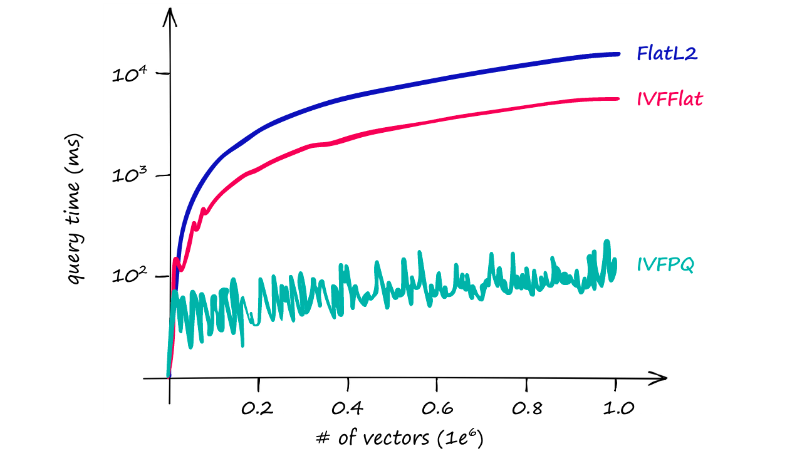
- 아래는 Flat vs PQ vs IVFPQ

  |Index|Memory|Query Time|Recall|Notes|
  |------|---|---|---|---|
  |Flat|~256Mb|~8.2ms|100%|Good for small datasets or where query time is irrelevant|
  |PQ|~6.5Mb|~1.49ms|50%|compression and search speeds, with reasonable recall score|
  |IVFPQ|~9.2Mb|~0.09ms|52%|impressive memory compression and search speeds, with reasonable recall scores.|

- IVFPQ 가 PQ 보다 메모리가 살짝 증가함을 보이지만 Recall 과 Query Speed 를 고려 했을 때 훨씬 더 Reasonable 해 보인다.


### When to use
- 벡터의 용량이 너무 커서 Memory 이슈가 있을 때 권고 된다.

# 4. LSH
### 작성중..

# 5. HNSW
### 작성중..

# Reference
- https://www.pinecone.io/
- https://github.com/facebookresearch/faiss/wiki/

